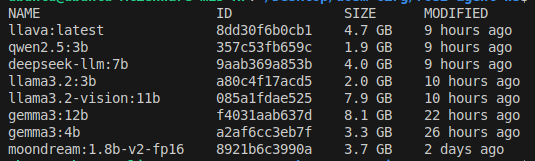
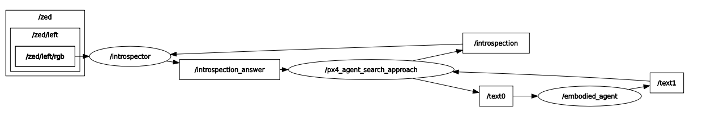
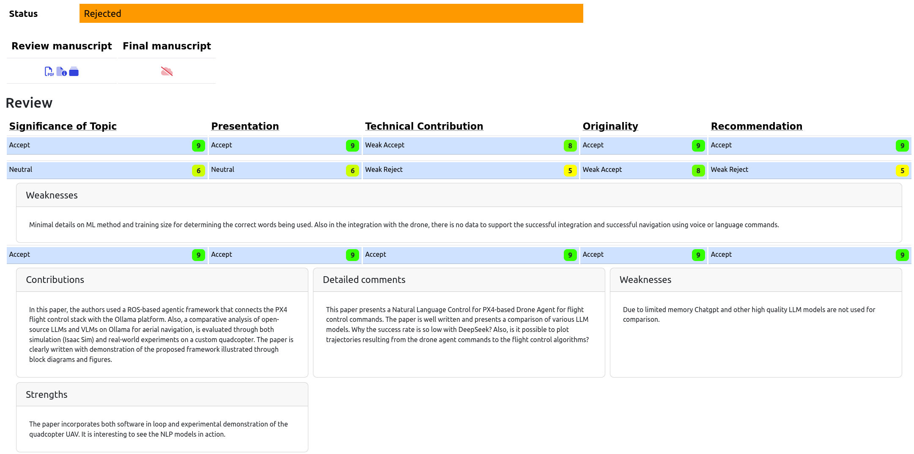

# ros2-px4-agent-ws


https://github.com/user-attachments/assets/e0ba7c40-c86a-4c45-ab21-ebf99011a593


https://github.com/user-attachments/assets/069eb3d0-76cd-48bf-947b-88494991641d


## Get started

1. Get [isaacsim](https://docs.isaacsim.omniverse.nvidia.com/4.5.0/installation/download.html) and the asset packs to populate your scene.
2. Get the [px4 extension plugin](https://github.com/limshoonkit/uosm.isaac.px4_bridge)
3. Get dependencies for [ros-agents](src/ros-agents/README.md)

```
git clone --recursive https://github.com/limshoonkit/ros2-agent-ws.git
# git submodule update --init --recursive
```

## To build
```
colcon build --packages-select px4_msgs
source install/setup.bash
colcon build
```

## To run
In one terminal, run the following. Wait awhile for the models to be downloaded. 
```
source install/setup.bash
python src/ros-agents/px4_examples/demo_search_and_approach_agent.py
```

You can check with `ollama list`.



In another terminal, run the following to start the ros2 px4 control loop. 
Make sure the px4_msgs are populated
```
source install/setup.bash
ros2 launch px4_agent_control px4_agent_search_approach.launch.py
```

You should see the following node graph in rqt



## Important Considerations

### 1. Drone Drift and PX4 Control Limitations
In some cases, the drone may drift excessively, and PX4’s control system may not compensate quickly enough. Consider reducing the sensor noise parameter in the PX4 OmniGraph inside Isaac Sim to improve stability.

### 2. Network Latency and Image Lag
Network delays can cause image transmission to the VLM to lag, potentially leading to inaccurate responses. To mitigate this, consider synchronizing clocks using Network Time Protocol (NTP).

### 3. Low Scene and Image Publishing FPS
If you're experiencing low frame rates for scene rendering or image publishing, try disabling colliders in the scene. The VLM only requires the visual mesh, so colliders are unnecessary for its operation.

### 4. Strict Goal Threshold
The goal threshold may be too tight for larger objects. In such cases, try setting the goal position at the edge of the object rather than its center of mass or adjust the threshold accordingly.


## Reviewer Comments



1. **Minimal details on ML method and training size for determining the correct words being used. Also in the integration with the drone, there is no data to support the successful integration and successful navigation using voice or language commands.**
   ```
   In response to the first comment regarding the "minimal details on the ML method and training size for determining the correct words being used,"
   the authors wish to clarify that the approach relies on pre-trained, open-source large language models (LLMs) and vision-language models (VLMs), rather than training new models from scratch.
   The paper clearly states its goal is to "democratize natural language control of autonomous drones" by integrating PX4 flight control, ROS 2 middleware, and locally hosted models via Ollama.
   Additionally, the authors would like to note that ongoing work aims to distill a lightweight VLA as part of future developments.

   In response to the second comment, the authors would like to clarify that the paper specifically refers to textual messages as the primary input.
   While support for voice commands is available, speech-to-text conversion using the OpenAI Whisper model can introduce errors due to the nuances of human speech.
   The authors also wish to highlight that a live flight demonstration utilizing speech commands was recently showcased as part of the SAFMC 2025 challenge using a speech-based setup.
   ```
   
2. **Why the success rate is so low with DeepSeek? Also, is it possible to plot trajectories resulting from the drone agent commands to the flight control algorithms?**
   ```
   In response to the first query regarding "Why the success rate is so low with DeepSeek?,"
   the authors would like to clarify that the evaluation was conducted using the DeepSeek-LLM model, not the more recently publicized DeepSeek-R1 model, which was unavailable at the time of testing.
   The authors also emphasize that the low success rate is addressed in the text: "Additionally, the DeepSeek model keeps producing erratic or reasoning-based responses,
   hence producing invalid commands even though system-level prompting required it to only generate responses in two formats: 'Move' and 'Turn'."

   In response to the second query, the authors thank the reviewer for the valuable suggestion.
   It is indeed feasible to plot the generated trajectory and compare it with the actual output from the flight controller.
   The natural language commands result in discrete "Move" and "Turn" actions, which can be sequentially chained to form a complete trajectory from start to finish.
   ```
